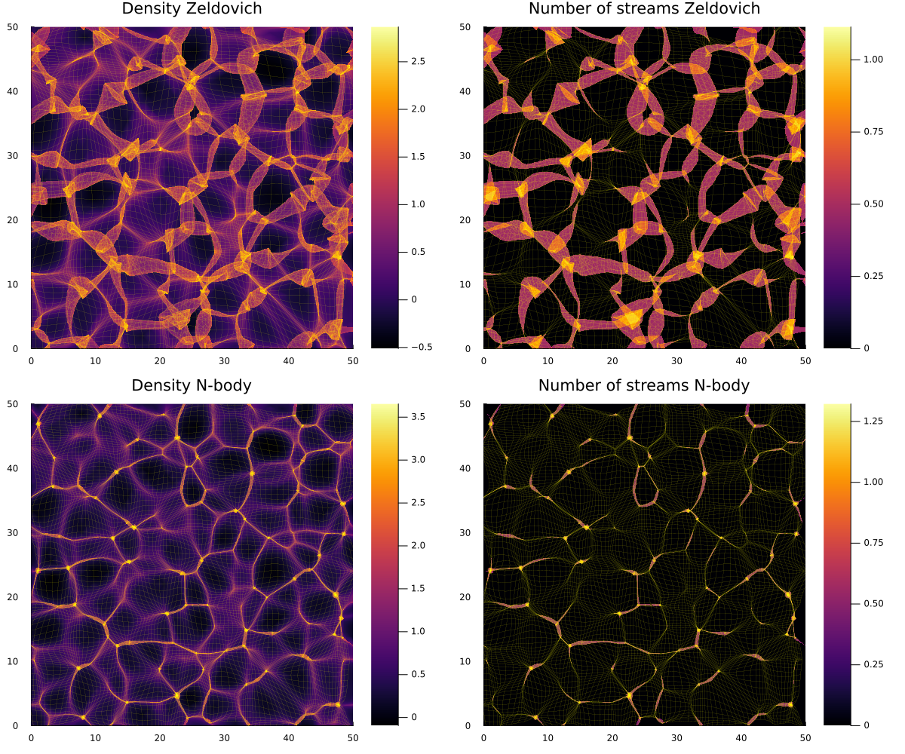

# Nbody2D.jl

[](https://jfeldbrugge.github.io/Nbody2D.jl/stable/)
[](https://jfeldbrugge.github.io/Nbody2D.jl/dev/)
[](https://github.com/jfeldbrugge/Nbody2D.jl/actions/workflows/CI.yml?query=branch%3Amain)
[](https://codecov.io/gh/jfeldbrugge/Nbody2D.jl)
[](https://doi.org/10.5281/zenodo.20115154)

This package is a particle mesh code that is inspired by Johan Hidding's [nbody2d](https://zenodo.org/records/4158731) Python code. See [jhidding.github.io/nbody2d](jhidding.github.io/nbody2d) for more details. It serves as a quick environment to learn and experiment with cosmological $N$-body simulations in the two-dimensional setting. Using the package:

* We create initial conditions by sampling both unconstrained and constrained Gaussian random fields.
* We evolve the initial perturbations to the current epoch.
* We estimate the density, velocity and number of stream fields using the Phase-Space Delaunay Tessellation Field Estimator.


[](docs/src/assets/figures/density.svg)

## Installation
The Nbody2D package can be installed with the Julia package manager.
From the Julia REPL, type `]` to enter the Pkg REPL mode and run:

```julia
pkg> add Nbody2D
```

Or, equivalently, via the `Pkg` API:

```julia
julia> import Pkg; Pkg.add("Nbody2D")
```

## Usage
Please have a look at the [Tutorial page](https://jfeldbrugge.github.io/Nbody2D.jl/stable/tutorial/) for details on how to use this package.

## Citation
When using this package for scientific research, please cite the Zenodo link [DOI:10.5281/zenodo.20115154](https://doi.org/10.5281/zenodo.20115154). You can use the Bibtex entry

```
@software{job_feldbrugge_2026_20115154,
  author       = {Job Feldbrugge},
  title        = {jfeldbrugge/Nbody2D.jl: Nbody2D.jl},
  month        = may,
  year         = 2026,
  publisher    = {Zenodo},
  version      = {v1.0.0},
  doi          = {10.5281/zenodo.20115154},
  url          = {https://doi.org/10.5281/zenodo.20115154},
}
```

## Contributors
This code was written by:
* Job Feldbrugge ([job.feldbrugge@ed.ac.uk](mailto:job.feldbrugge@ed.ac.uk))
