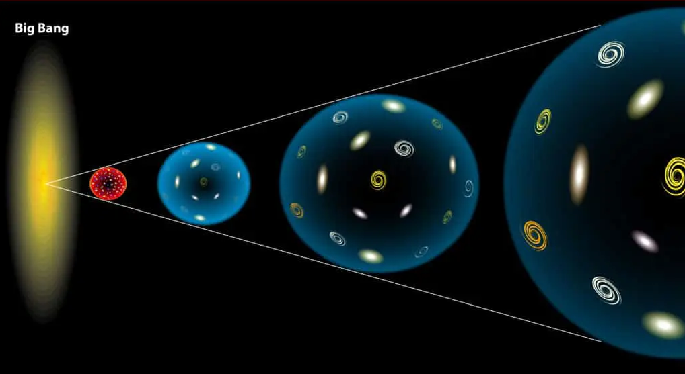
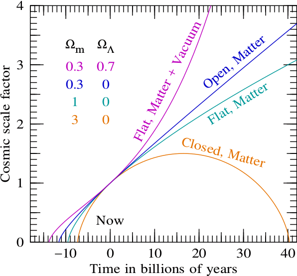
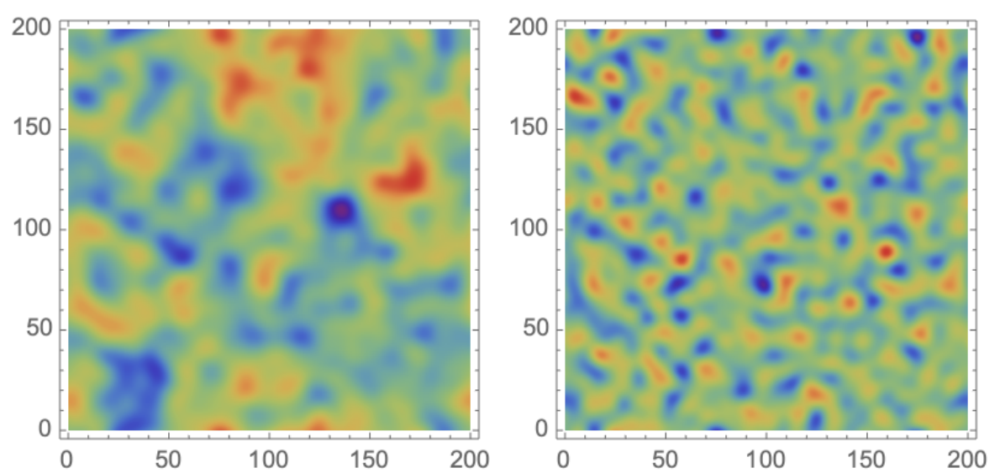
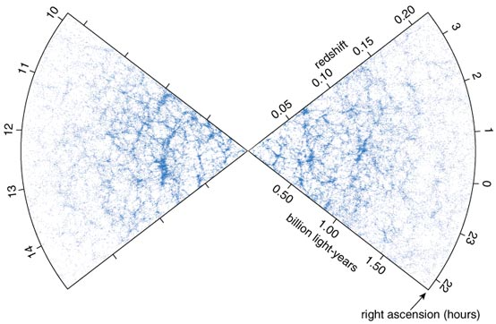

```@meta
CurrentModule = Nbody2D
```

# Theory
We give a brief theoretical description of large-scale structure formation to provide a foundation for this package. 

* We create initial conditions by sampling both an unconstrained and a constrained Gaussian random field
* We evolve the initial conditions into the cosmic web with an $N$-body simulation
* We evaluate the density, velocity and number of stream fields with the Phase-Space Delaunay Tessellation Field Estimator. 

For an introduction to cosmology and large-scale structure formation, we refer to [Introduction to Cosmology by Barbara Ryden](https://www.cambridge.org/gb/universitypress/subjects/physics/cosmology-relativity-and-gravitation/introduction-cosmology-2nd-edition-1?format=HB&isbn=9781107154834). For more information on Gaussian random field theory and the Phase-Space Delaunay Tessellation Field Estimator see this [introduction](https://jfeldbrugge.github.io/Gaussian-Random-Field/) and the [PhaseSpaceDTFE.jl](https://jfeldbrugge.github.io/PhaseSpaceDTFE.jl/stable/theory/) package.

## Cosmology
Einstein's theory of gravitation turned our Universe into a dynamical object. Space-time expands and contracts as a function of its energy content.

[](https://github.com/jfeldbrugge/Nbody2D.jl/blob/main/docs/src/assets/figures/Expanding_Universe.png)


In a homogenous and isotropic Friedmann–Lemaître–Robertson–Walker universe, the Einstein field equations reduce to the Friedmann equation

```math
H(t)^2 = \left(\frac{\dot{a}(t)}{a(t)}\right)^2 = H_0^2\left[ \frac{\Omega_{0, r}}{a(t)^{4}} + \frac{\Omega_{0,m}}{ a(t)^{3}} + \frac{\Omega_{0,k}}{ a(t)^{2}} + \Omega_{0,\Lambda}\right]\,.
```

The Friedmann equation describes the expansion history of our Universe through the scale factor $a(t).$ At the Big Bang, the Universe was infinitesimally small, corresponding to the scale factor $a(0)=0.$ As the Universe expands, with the expansion rate $H(t)=\dot{a}(t)/a(t)$ known as the Hubble parameter, the scale factor increases to the scale factor today $a(t_0)=1.$ The evolution is expressed in terms of the current Hubble parameter $H(t_0)=H_0,$ the current radiation density parameter $\Omega_{0,r},$ the current matter density parameter $\Omega_{0,m},$ the current curvature parameter $\Omega_{0,k}$ and the dark energy parameter $\Omega_{0,\Lambda}.$ See the figures below for a set of possible expansion histories.

[](https://github.com/jfeldbrugge/Nbody2D.jl/blob/main/docs/src/assets/figures/scalefactor.png)

## Initial conditions 
Gaussian random fields are crucial to modern cosmology as theories for the early universe predict a nearly homogeneous and isotropic universe with tiny, close to Gaussian, density fluctuations

```math
\delta(\bm{q}) = \frac{\rho(\bm{q})}{\bar{\rho}} - 1\,,
```

with the energy density $\rho$ and the mean density $\bar{\rho}.$ After the epoch of recombination, these fluctuations gravitationally collapsed to form the present day cosmic web.

### Gaussian random fields
Theories for the origin of our Universe describe the density perturbation $\delta:\mathbb{R}^d \to \mathbb{R}$ on the space $\mathbb{R}^d$ in terms of random fields. Instead of predicting a particular distribution of the energy in the early universe, the theories describe its statistical properties. We will here restrict attention to Gaussian random fields. For an example of a realization see the figure below.

[](https://github.com/jfeldbrugge/Nbody2D.jl/blob/main/docs/src/assets/figures/GRF.png)

#### The definition
By construction, the density perturbation has zero mean

```math
\langle \delta \rangle = \langle \rho(\bm{q}) \rangle / \bar{\rho} - 1 =0\,.
```

When $\delta$ is a realisation of a stationary Gaussian random field, the spatial correlations are fully characterised by the two-point correlation function

```math
\xi(\bm{q}_1,\bm{q}_2) = \langle \delta(\bm{q}_1) \delta(\bm{q}_2) \rangle\,,
```

through the functional distribution

```math
p(\delta)   = e^{-\frac{1}{2} \iint \delta(\bm{q}_1) K(\bm{q}_1,\bm{q}_2) \delta(\bm{q}_2)\mathrm{d}\bm{q}_1\mathrm{d}\bm{q}_2}\,.
```

The kernel $K$ is defined as the inverse of the two-point correlation function

```math
\int K(\bm{q}_1,\bm{q}) \xi(\bm{q},\bm{q}_2) \mathrm{d}\bm{q} = \delta_D^{(d)}(\bm{q}_1 - \bm{q}_2),
```

with $\delta_D^{(d)}$ the $d$-dimensional Dirac delta function. Given a set of fields $S,$ the probability that $\delta \in S$ is given by the functional integral

```math
P[\delta \in S] = \int_S e^{-\frac{1}{2} \iint \delta(\bm{q}_1)K(\bm{q}_1,\bm{q}_2) \delta(\bm{q}_2)\mathrm{d}\bm{q}_1 \mathrm{d}\bm{q}_2} \mathcal{D}\delta
```

with $\mathcal{D}\delta$ the path integral measure. From the cosmological principle it follows that the initial conditions of our universe are statistically *homogeneous* (all points are statistically equivalent) and statistically *isotropic* (all directions are statistically equivalent). For a statistically homogenous and isotropic random field, the two-point correlation function and the inverse $K$ only depends on the distance between the points, *i.e.*

```math
\xi(\bm{q}_1,\bm{q}_2) = \xi(\|\bm{q}_1-\bm{q}_2\|).
```

#### Fourier space
Gaussian random fields are conveniently described in terms of Fourier space. Given the Fourier transform

```math
\hat{\delta}(\bm{k}) = \int \delta(\bm{q}) e^{i \bm{k}\cdot \bm{q}} \mathrm{d}\bm{q}\,,
```

the two-point correlation function of the Fourier modes is diagonal

```math
\langle \hat{\delta}(\bm{k}_1) \hat{\delta}^*(\bm{k}_2)\rangle 
=(2\pi)^d \delta_D^{(d)}(\bm{k}_1-\bm{k}_2) P(\|\bm{k}_1\|),
```

with the change of coordinates $\bm{r} = \bm{q}_1-\bm{q}_2$ and $\bm{q}=\bm{q}_2$ and where the *power spectrum* $P(k)$ describes the amplitude corresponding to Fourier modes. The power spectrum is the Fourier transform of the correlation function

```math
P(k) = \int e^{i \bm{k} \cdot \bm{r} } \xi(\|\bm{r}\|) \mathrm{d}\bm{r}\,.
```

As it turns out, the Fourier modes are independent Gaussian variables

```math
p(\hat{\delta}) = \exp\bigg[-\frac{1}{2}\int \frac{|\hat{\delta}(\bm{k})|^2}{P(\|\bm{k}\|)}\frac{\mathrm{d}\bm{k}}{(2\pi)^d} \bigg]\,,
```

modulo the reality condition 

```math
\hat{\delta}^*(-\bm{k}) = \hat{\delta}(\bm{k})\,.
```

A reasonable model for the primordial displacement potential is the power-law power spectrum smoothed with a Gaussian filter

```math
P_\phi(k) = \frac{α^2  4 \pi R_s^{2 + n_s}}{\Gamma\left(1 + \frac{n_s}{2}\right)}  k^{n_s - 4}  e^{-R_s^2  k^2}\,,
```

with the spectral index $n_s,$ the smoothing length $R_s,$ and normalization constant $\alpha.$


#### Generating realisations
In the discussion above, we observe that Gaussian random fields are most easily expressed in Fourier space as the exponent of the distribution is diagonal in $\hat{\delta}.$  Generating an unconstrained realization of a Gaussian random field on a regular lattice $\{ \bm{q}_{i_1,\dots,i_d}\},$ with the values $\delta_{i_1,\dots,i_d} = \delta(\bm{q}_{i_1,\dots,i_d}),$ reduces to sampling the normally distributed Fourier modes $\hat{\delta}_{i_1,\dots,i_d}$ and a single Fast Fourier transform.

When studying the formation of a specific geometric feature in the cosmic web, it is convenient to sample the initial conditions subject to linear constraints

```math
\Gamma  = \{ C_i \equiv C_i[\delta;\bm{q}_i] = c_i| i = 1,\dots,M\},
```

at the points $\bm{q}_i$ and values $c_i \in \mathbb{R}$ for $i=1,\dots, M.$ Linear constraints include the function value in a point

```math
C[\delta;\bm{q}_i] = \delta(\bm{q}_i),
```

a derivative 

```math
C[\delta;\bm{q}_i] = \frac{\partial \delta}{\partial q_i} (\bm{q}_i),
```

or more generally, a convolution with some kernel $g,$

```math
C[\delta;\bm{q}_i] = \int g(\bm{q}_i - \bm{q})\delta(\bm{q}) \mathrm{d}\bm{q}.
```

Constrained Gaussian random fields with linear constraints are efficiently sampled with the Hoffman-Ribak algorithm. First, using Bayes formula, we write the conditional distribution

```math
p(\delta|\Gamma) = \frac{p(\delta, \Gamma)}{p(\Gamma)} = \frac{p(\delta)}{p(\Gamma)},
```

where $p(\delta, \Gamma) = p(\delta)$ since $\Gamma$ is a linear functional of $\delta.$ Since the constraints $C_i$ are linear, the distribution $p(\Gamma)$ is  Gaussian,

```math
p(\Gamma) = \frac{\exp\left[-\frac{1}{2} \bm{C}^T Q^{-1} \bm{C}\right]}{\sqrt{(2\pi)^M \det Q}},
```

with the vector $\bm{C}=(C_1,\dots,C_M)$ and the covariance matrix 

```math
Q = \left\langle \bm{C}^T \bm{C}\right\rangle.
```

The constrained distribution thus takes the form

```math
p(\delta|\Gamma)=
\sqrt{(2\pi)^M \det Q} \ 
e^{-\frac{1}{2} \left(\iint \delta(\bm{q}_1) K(\bm{q}_1-\bm{q}_2) \delta(\bm{q}_2) \mathrm{d} \bm{q}_1 \mathrm{d}\bm{q}_2 - \bm{C} Q^{-1} \bm{C}\right)}\,,
```

which we can rewrite as

```math
p(\delta|\Gamma)=
\sqrt{(2\pi)^M \det Q}e^{-\frac{1}{2} \iint F(\bm{q}_1)K(\bm{q}_1-\bm{q}_2) F(\bm{q}_2)\mathrm{d}\bm{q}_1\mathrm{d}\bm{q}_2}\,,
```

where $F$ is the deviation of $\delta$ with respect to the constrained mean field 

```math
\bar{\delta}(\bm{q}) = \langle \delta(\bm{q})|\Gamma \rangle\,.
```

The residue $F$ is a Gaussian random field that is independent of the values $c_i$ and only depend on the details of the constraints $C_i.$ This observation enables the efficient sampling by the Hoffmann and Ribak (1991) algorithm:

* Generate an unconstrained Gaussian random field $\tilde{\delta}$ with the given power spectrum.
* Evaluate the constraints on the realization $C_i[\tilde{\delta}] = \tilde{c}_i.$
* Construct the mean field corresponding to the values $\tilde{c}_i$ and evaluate the residue 

```math
F = \tilde{\delta} - \xi_i(\bm{q}) \xi_{ij}^{-1} \tilde{c}_j.
```

* Add the residue $F$ to the mean field $\bar{\delta}$ to obtain the constrained realization
$$\delta = F + \xi_i(\bm{q}) \xi_{ij}^{-1} c_j.$$

with the correlation functions

```math
\xi_i(\bm{q}) = \langle \delta(\bm{q}) C_i(\bm{q}_i)\rangle\,,
```

and 

```math
\xi_{ij} = \langle C_i(\bm{q}_i)C_j(\bm{q}_j)\rangle\,.
```

## Structure formation
In large-scale structure formation, the cosmic web forms due to the gravitational collapse of small fluctuations in an evolving background space-time.

[](https://github.com/jfeldbrugge/Nbody2D.jl/blob/main/docs/src/assets/figures/Cosmic_Web.png)

In an expanding universe, the gravitational potential $\phi$ is governed by the Poisson equation

```math
\nabla^2 \phi = 4 \pi G \bar{\rho} a^2 \delta\,,
```

with Newton's constant $G.$ We follow the motion of matter through the map 

```math
\bm{x}_t(\bm{q}) = \bm{q} + \bm{s}_t(\bm{q})\,,
```

capturing the motion of a mass element starting at point $\bm{q}$ as a function of time through the displacement map $\bm{s}_t.$ The particles move according to the Euler equation

```math
\frac{\partial (a \bm{v})}{\partial t} = -\nabla \phi\,,
```

with the comoving velocity $\bm{v} = a \dot{\bm{x}_t}.$ Working in terms of the momentum $\bm{p} = a^2 \dot{x}=a \bm{v}$ and using the identity

```math 
4 \pi G \bar{\rho} = \frac{3 H_0^2 \Omega_{0,m}}{2 a^3}\,,
```

the Poisson and Euler equations assume the form 

```math 
\begin{align*}
    a \nabla^2 \phi &=\frac{3}{2} \Omega_{0,m} H_0^2 \delta\,,\\
    \partial_t \bm{p} &= -\nabla \phi\,.
\end{align*}
```

In these equations, the time dependence enters through the evolution of the scale factor. When the scale factor $a$ is a monotonically increasing function, it is natural to parametrise time in terms of the scale factor and express the equations of motion as 

```math
\begin{align*}
    \partial_a \bm{x} &= \frac{\bm{p}}{a^2 \dot{a}}\,,\\
    \partial_a \bm{p} &= - \frac{\nabla \phi}{\dot{a}}\,. 
\end{align*}
```

This formalism saves us from having to solve the Friedmann equation. In this package, we solve this set of equations with a first-order Leap-Frog method, consisting of a drift and a kick operation.

## Density estimation
This package includes a two-dimensional implementation of the Phase-Space Delaunay Tessellation Field Estimator (PS-DTFE) for the estimation of the density, the velocity and the number of streams fields. The method traces the dark matter sheet in phase-space and evaluates the density and velocity fields by linearly interpolating in the simplices spanning the dark matter sheet. For example, the PS-DTFE method approximates the density formula

```math
\rho(\bm{x}) = \sum_{\bm{q} \in \bm{x}_t^{-1}(\bm{x})} \frac{\bar{\rho}}{|\det \nabla \bm{x}_t(\bm{q})|}\,,
```

using the $N$-body particles. For a detailed description, see the package [PhaseSpaceDTFE.jl](https://jfeldbrugge.github.io/PhaseSpaceDTFE.jl/stable/theory/), which implements the PS-DTFE method in 3D.
